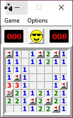

# Minegauler v4.1.0

Remake of the classic Minesweeper game, written in Python.

Read more about the project history in [my blog post](https://www.lewisgaul.co.uk/blog/coding/2020/02/12/minegauler/).

## Try it out!

### Download the executable

The application has been packaged with PyInstaller so that it can be played without setting up Python.

Download links available here:
 - [Windows](https://github.com/LewisGaul/minegauler/releases/latest/download/minegauler-v4.0.7-windows-latest.zip)
 - [Linux](https://github.com/LewisGaul/minegauler/releases/latest/download/minegauler-v4.0.7-ubuntu-latest.tgz)
 - [Mac](https://github.com/LewisGaul/minegauler/releases/latest/download/minegauler-v4.0.7-macOS-latest.tgz)

### Install from PyPI

The Python package is also available on PyPI: https://pypi.org/project/minegauler/.

 1. Python 3.7+ required
 2. Install with `pip install minegauler`
 3. Run with `python -m minegauler`

See note on system dependencies below, or [get in touch](#Contact) if you have any issues.

### Clone the repo

You will need Python 3.7+ to run the code (see note below about known system dependencies).

 1. Clone the repo: `git clone https://github.com/LewisGaul/minegauler`
 2. Consider setting up a [virtual environment](https://docs.python.org/3/tutorial/venv.html)
 3. Install requirements with `pip install -r requirements.txt`
 4. Run with `python -m minegauler`

#### System dependencies

Annoyingly, the latest version of PyQt5 introduced a new system dependency on Linux, and this new version is required to run on Python3.8+.

If running with `python -m minegauler` fails with `Aborted (core dumped)` on Linux, try installing the dependency with:  
`sudo apt install libxkbcommon-x11-0`

## What's new/upcoming?

Check the [changelog](CHANGELOG.md) to see a log of changes that have been made, as well as some of the upcoming features and planned fixes.

If there's a feature you'd like to see added, please don't hesitate to [contact me](#Contact)!

## Development guide

Install the developer requirements (e.g. pytest + plugins) with `pip install -r requirements-dev.txt`.

Run the tests with the command: `python -m pytest`.

Get coverage information using the pytest-cov plugin: `python -m pytest --cov [--cov-report html]`.

## Contact

Email at minegauler@gmail.com, any questions/suggestions/requests welcome.

Alternatively, feel free to open an issue if you find a bug or have a feature request.
