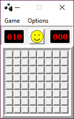

# MineGauler

Remake of the classic Minesweeper game, written in Python. The entry point to the program is main.py in the src folder. Requirements: Python version 3.6+, PyQt5.

To play without any python requirements, check the bin folder for the zipped folders containing distributions, or download here:  
[Windows, version 2.1.1b0](https://www.dropbox.com/s/bmxbrwq40phlq92/windows.zip?dl=1)

Contact: minegauler@gmail.com, any questions/suggestions/requests welcome.
