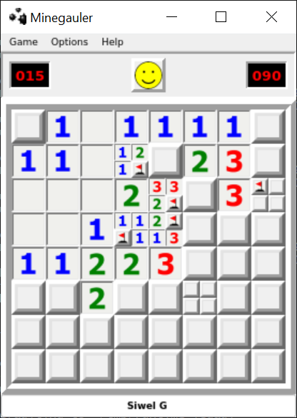
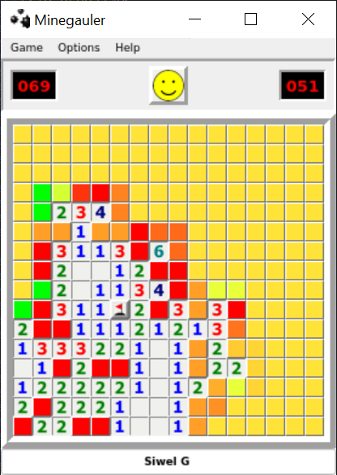

# Minegauler v4.2.0-b0

Remake of the classic Minesweeper game, written in Python.

Read more about the project history in [my blog post](https://www.lewisgaul.co.uk/blog/coding/2020/02/12/minegauler/).

   

## Try it out!

### Download the executable

The application has been packaged with PyInstaller so that it can be played without setting up Python.

Download links available here:
 - [Windows (amd64)](https://github.com/LewisGaul/minegauler/releases/latest/download/minegauler-v4.1.6-windows-amd64.zip)
 - [Linux (x86_64)](https://github.com/LewisGaul/minegauler/releases/latest/download/minegauler-v4.1.6-linux-x86_64.tar.gz)
 - [MacOS (x86_64)](https://github.com/LewisGaul/minegauler/releases/latest/download/minegauler-v4.1.6-macos-x86_64.tar.gz)

### Install from PyPI

The Python package is also available on PyPI: https://pypi.org/project/minegauler/.

 1. Python 3.8+ required (check with `python3 --version`)
 2. Install with `python3 -m pip install minegauler`
 3. Run with `python3 -m minegauler`

See note on system dependencies below, or [get in touch](#Contact) if you have any issues.

### Clone the repo

You will need Python 3.8+ to run the code (check with `python3 --version`).

 1. Clone the repo: `git clone https://github.com/LewisGaul/minegauler`
 2. Change directory: `cd minegauler`
 3. Consider setting up a [virtual environment](https://docs.python.org/3/tutorial/venv.html)
 4. Install requirements with `python3 -m pip install -r requirements.txt`
 5. Run with `python3 -m minegauler`

### System dependencies

#### WSL

If running in WSL (Windows Subsystem for Linux) you will need to set up an X-server for running graphical apps. This isn't too difficult to do, see <https://wiki.ubuntu.com/WSL#Running_Graphical_Applications> or search online for further advice - I would recommend downloading and using Xming.

#### Linux

If running with `python -m minegauler` fails with `Aborted (core dumped)` on Linux, you may need a package that provides graphical support. For me this was fixed by running `sudo apt install libxkbcommon-x11-0` on Ubuntu in WSL1.

## Features

This app provides all of the basic functionality of the classic minesweeper game plus much more!

### Special features

Game menu:
* Create boards - create a board by placing mines, which can then be saved and loaded.
* Save and load boards - challenge friends to a board you played or created.
* Get current game info - see some info about the current game, e.g. if you lose a game you get a completion percentage and a predicted time.
* Local highscores - stores highscores and allows filtering/sorting in the UI.
* 5 difficulty levels - the standard beginner, intermediate and expert, plus two bonus levels of increasing difficulty!
* Custom - set a custom board size and number of mines.
* Button size - set the size of the cells.
* Themes - app themes include 'butterfly', 'halloween', 'christmas'.

Options menu:
* Safe start - ensure the first click always gives an opening, or at least gives a safe cell if there are too many mines to give an opening.
* Drag select - enable selecting cells by clicking once and dragging the mouse.
* Max mines per cell - allow up to 3 mines per cell.
* Reach - the number of neighbouring cells cell numbers detect.
* Game mode
  * Regular - the standard minesweeper game.
  * Split cell - Each large cell can be split into the 4 underlying regular cells using 'right-click'. Large cells can only be split if they contain at least one mine, and must be split to find all of the safe regular cells.

Note that all of the options above except 'safe start' have separate highscore tables.

Help menu:
* Rules, features, tips.
* Retrieve highscores - import highscores from an old version of the app (only works for versions at least v4.0).

### What's new/upcoming?

Check the [changelog](CHANGELOG.md) to see a log of changes that have been made. See [issues](https://github.com/LewisGaul/minegauler/issues) for upcoming features/fixes.

If there's a feature you'd like to see added, please don't hesitate to [contact me](#Contact)!

## Development guide

Install the developer requirements with `python3 -m pip install -r requirements-dev.txt`.

Run the tests with the command `pytest` (see the [pytest docs](https://docs.pytest.org/en/latest/how-to/usage.html)).

Get coverage information using the pytest-cov plugin: `pytest --cov minegauler [--cov-report html]`.

## Contact

Please don't hesitate to [open an issue](https://github.com/LewisGaul/minegauler/issues/new) or a [discussion](https://github.com/LewisGaul/minegauler/discussions) if you think you've found a bug, have a feature request, or just want to say hi!

You can also email at [minegauler@gmail.com](mailto:minegauler@gmail.com).
